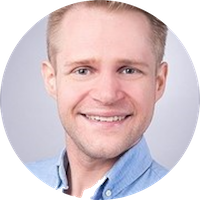
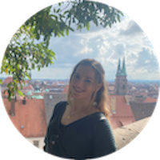
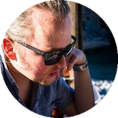
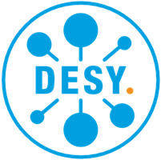
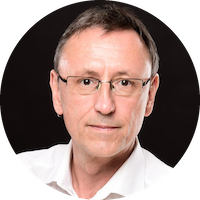

## University of Hamburg

<ul>
    <li><strong>Affiliation:</strong> University of Hamburg</li>
    <li><strong>Website:</strong> <a href="https://celine.hadzii.com">celine.hadzii.com</a>, <a href="https://www.geo.uni-hamburg.de/en/geophysik/forschung/seismology.html">UHH Seismology</a></li>
    <li><strong>Publications:</strong> <a href="https://scholar.google.de/citations?hl=en&user=WvhdbrgAAAAJ">Google Scholar</a></li>
    <li><strong>Interests:</strong> Prof. Dr. Celine Hadziioannou is fascinated by exploring the information contained in seismic signals recorded in the absence of earthquakes, during seismically quiet times. These signals are usually discarded as ‘noise’ but consist of seismic waves that carry the imprint of the sources that generated them, and of the material that they passed through.</li>
    <li><strong>Collaborations:</strong> <a href="https://spin-itn.eu/">SPIN</a>, an Innovative Training Network (ITN) funded by the European Commission (Horizon 2020), which focuses on using the latest ground-motion sensing technology to improve the monitoring of geohazards.</li>
</ul>

---

### Prof. Dr. Oliver Gerberding

<ul>
    <li><strong>Affiliation:</strong> Institut für Experimentalphysik, University of Hamburg</li>
    <li><strong>Website:</strong> <a href="https://www.physik.uni-hamburg.de/iexp/gwd">Gravitational wave detection</a></li>
    <li><strong>Publications:</strong> <a href="https://scholar.google.com/citations?user=-h2HvqcAAAAJ&hl=de">Google Scholar</a>, <a href="https://orcid.org/0000-0001-7740-2698">ORCID</a></li>
    <li><strong>Interests:</strong> Oliver Gerberding works on reducing seismic and control noise in gravitational wave detectors with the help of compact interferometers and inertial sensors. He studies methods to use distributed acoustic sensing to optimize seismic isolation systems in current and future detectors. His group also investigates methods to reduce the influence of scattered light in laser interferometers. In addition, he works on developing technologies for space-based detectors like LISA and moon-based detectors like the Lunar Gravitational Wave Antenna (LGWA).</li>
    <li><strong>Collaborations:</strong>
        <ul>
            <li><a href="https://www.ligo.org/">LIGO-Virgo-Kagra Collaboration</a></li>
            <li><a href="https://www.et-gw.eu/">Einstein Telescope Collaboration</a></li>
            <li><a href="https://www.lisamission.org/">LISA Consortium</a></li>
            <li><a href="http://lgwa.unicam.it/index.php">LGWA Collaboration</a></li>
        </ul>
    </li>
</ul>

---

### Antonia Kiel

<ul>
    <li><strong>Affiliation:</strong> Institute of Geophysics, University of Hamburg</li>
    <li><strong>Interests:</strong> Antonia Kiel works in the field of seismology and machine learning. In the context of the CLICCS excellence cluster of the University of Hamburg, she worked on monitoring shallow groundwater in the urban area using <a href="https://www.youtube.com/watch?v=9IATkjy-sdA&t=402s">ambient seismic noise</a>. Using the distributed acoustic sensing data of the WAVE project, she compared different unsupervised clustering methods to detect different noise sources at the fiber, developing a workflow for choosing appropriate clustering methods under various circumstances.</li>
    <li><strong>Collaborations:</strong> <a href="https://www.cliccs.uni-hamburg.de/de.html">CLICCS</a></li>
</ul>

---

### Dr. Alexander Bauer

<ul>
    <li><strong>Affiliation:</strong> Institute of Geophysics, University of Hamburg</li>
    <li><strong>Website:</strong> <a href="https://www.researchgate.net/profile/Alexander-Bauer-3">ResearchGate</a></li>
    <li><strong>Publications:</strong> <a href="https://scholar.google.de/citations?user=yxmye-sAAAAJ">Google Scholar</a></li>
    <li><strong>Interests:</strong> With a methodic background in exploration seismology, Dr. Bauer has spent the past decade working on seismic data characterization by means of wavefront attributes, tomographic velocity model building, and wavefield separation - the latter mainly for the separation of reflected and diffracted (scattered) wavefields. Most recently, Dr. Bauer has utilized machine learning methods for wavefield separation and for the prediction of earthquake waveforms.</li>
    <li><strong>Collaborations:</strong> ErUM-WAVE</li>
</ul>

---

### Oliver Bölt

<ul>
    <li><strong>Affiliation:</strong> Institute of Geophysics, University of Hamburg</li>
    <li><strong>Website:</strong> <a href="https://www.geo.uni-hamburg.de/en/geophysik/personen/boelt-oliver.html">Oliver Bölt Profile</a></li>
    <li><strong>Interests:</strong> Oliver Bölt is a doctoral researcher in the field of machine learning in geophysics. Using deep learning and seismic interferometry, he worked on determining transfer functions of seismic data. His current work focuses on applying machine learning methods to large distributed acoustic sensing datasets with the aim of automatically detecting and classifying different types of seismic signals.</li>
</ul>

---

## DESY

<!-- You can add content related to DESY here -->

---

### Dr. Holger Schlarb

<ul>
    <li><strong>Coordinator</strong></li>
    <li><strong>Affiliation:</strong> Deutsches Elektronen-Synchrotron (DESY)</li>
    <li><strong>Website:</strong> <a href="https://msk.desy.de/">Machine Beam Control group</a>, <a href="https://www.desy.de/index_eng.html">desy.de</a></li>
    <li><strong>Publications:</strong> <a href="https://msk.desy.de/e88991/e89336/index_ger.html">Scientific Journal Articles</a>, <a href="https://orcid.org/0000-0003-4115-5183">ORCID</a
